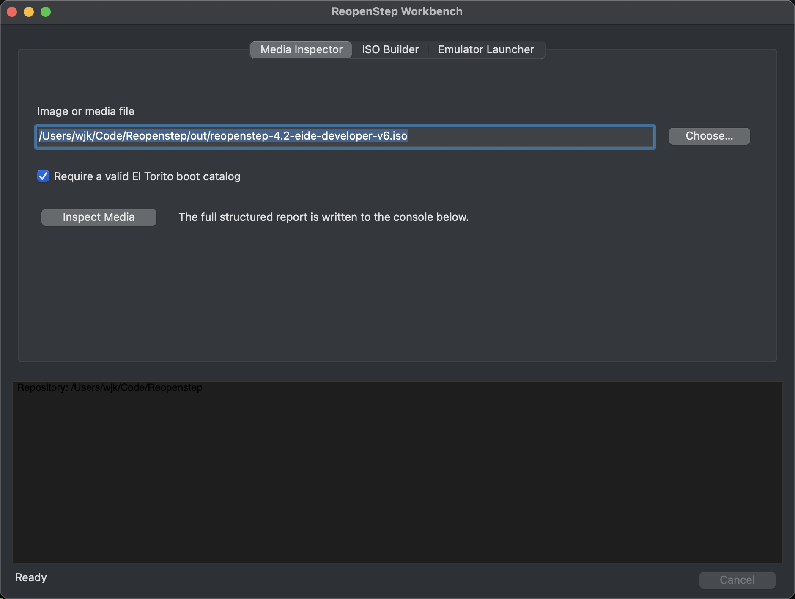

# ReopenStep Workbench

ReopenStep Workbench is a GNUstep/AppKit front end for the repository's
reproducible command-line tools. It never constructs a shell command: paths and
options are passed to `NSTask` as argument arrays, and combined stdout/stderr is
streamed into the application console.



The Media Inspector provides the first native surface for validating source
media before it enters a reproducible build recipe.

The first application milestone includes:

- Media Inspector, including optional bootability enforcement.
- Bootable ISO Builder with User UFS, startup image, Developer UFS, and NeXT
  disk-label inputs.
- QEMU and 86Box launchers with install, rescue, and installed-disk modes.
- Installation Composer with payload selection, reviewable recipe generation,
  classic package building, and structural inspection.

The Installation Composer now accepts a staged payload tree, emits a reviewable
recipe, and builds the four-part classic OPENSTEP Installer package through the
shared CLI. The next composer increment will group adopted packages such as
Patch 4, KB7SQI, Big Green Disc, and Lighthouse, add installation scripts and
localized resources, and feed selected results into UFS and ISO mastering.
Package contents stay in the ignored vault rather than the application bundle
or Git history.

The application locates the repository by walking upward from its working
directory and application bundle. Set `REOPENSTEP_ROOT` when the application is
installed elsewhere.

## GNUstep build

Install GNUstep Make, Base, GUI, and a graphical backend, then load the normal
GNUstep environment and run:

```sh
cd apps/ReopenStepWorkbench
make -f GNUmakefile
openapp ./ReopenStepWorkbench.app
```

## macOS build

The same sources build directly against Cocoa for rapid development and QA:

```sh
make -C apps/ReopenStepWorkbench -f Makefile mac
make -C apps/ReopenStepWorkbench -f Makefile test
open apps/ReopenStepWorkbench/build/ReopenStepWorkbench.app
```

Image manipulation remains in `reopenstep_tool`; adding a GUI action should
normally mean adding an argument-array adapter, not duplicating Python logic in
Objective-C.
