# ReopenStep architecture

This diagram shows the build, mastering, boot, and validation paths. Solid
arrows are required data/control flow; dashed arrows are optional test or
future-farm paths.

```mermaid
flowchart LR
    subgraph Inputs[Vault and source inputs]
        U[OpenStep 4.2 User]
        D[OpenStep 4.2 Developer]
        P4[Patch 4 User/Developer tarballs]
        DR[Driver drops\nEIDE / ATAPI / BusLogic / Adaptec / VBE / Matrox]
        PKG[Installer packages\nKB7SQI / Big Green Disc / Lighthouse]
    end

    subgraph Compose[Host-side mastering]
        BOM[Composer\nmkbom / lsbom / recipe]
        UFS[nextufs\nUFS tree overlay]
        LABEL[NeXT dlV3 label\nand partition metadata]
        ISO[Hybrid ISO master\nEl Torito + NeXT UFS]
    end

    subgraph Boot[BootE / itomato Chameleon]
        BIOS[Socket 370 BIOS\nQEMU / 86Box / real hardware]
        CDBOOT[cdboot\nno-emulation El Torito]
        UFSREAD[Big-endian UFS reader\nNeXT label discovery]
        SARLD[sarld\nstandalone reloc linker]
        KBS[KERNBOOTSTRUCT\n0x11000 handoff]
    end

    subgraph Kernel[OPENSTEP runtime]
        MACH[mach_kernel\nPatch 4]
        DK[DriverKit startup\nEISA / PCI / PS2 / EIDE / SCSI / VBE]
        ROOT[Root device\nATA/ATAPI or SCSI]
        INST[Installer / CDIS\nUser + Developer packages]
    end

    subgraph Farm[Quad-fat build farm]
        PLAN[Native job plan\narchitecture slices]
        CTRL[Next-native controller\nDistributed Objects]
        WORK[Socket 370 workers\ni386 build slices]
        FAT[Quad-fat validator\nand release artifacts]
    end

    U --> UFS
    D --> UFS
    P4 --> UFS
    DR --> UFS
    PKG --> BOM --> UFS
    UFS --> LABEL --> ISO
    ISO --> CDBOOT
    BIOS --> CDBOOT
    CDBOOT --> UFSREAD --> MACH
    UFSREAD --> SARLD --> KBS
    KBS --> MACH
    MACH --> DK --> ROOT --> INST

    UFS -. secondary Developer/Rhapsody/Darwin partition .-> ISO
    BIOS -. GDB stub / monitor / screenshots .-> KBS
    ISO -. QEMU/86Box matrix .-> BIOS

    PLAN --> CTRL --> WORK --> FAT
    FAT -. package and image inputs .-> BOM
    FAT -. validated release media .-> ISO
```

## Runtime contract

BootE loads the i386 kernel and the selected `_reloc` driver images, then
constructs the legacy `KERNBOOTSTRUCT` expected by OPENSTEP. The storage HCL is
intentionally broad: the media contains EIDE/ATAPI, BusLogic, and Adaptec
paths, while a machine profile determines which controller is expected to
attach. The currently exercised QEMU path detects an ATA disk and ATAPI CD,
reads their `OPENSTEP_4.2` labels, and selects the CD root.

The PS/2 keyboard and mouse images are both preloaded because the keyboard
driver depends on the shared `PS2Controller` class. If an early boot stalls,
use the QEMU GDB/monitor path documented in `tools/boote/README.md` to inspect
the handoff structure, registers, and reset/interrupt log.

## Artifact boundaries

- `out/boote/*.iso` is generated media and is never committed.
- `vault/` and driver/package drops are proprietary inputs, not source assets.
- `docs/` records the reverse-engineered ABI, table formats, and validation
  evidence needed to reproduce the build.
- The farm consumes architecture-slice recipes and emits validated fat
  artifacts; it does not alter the historical OPENSTEP runtime contract.
