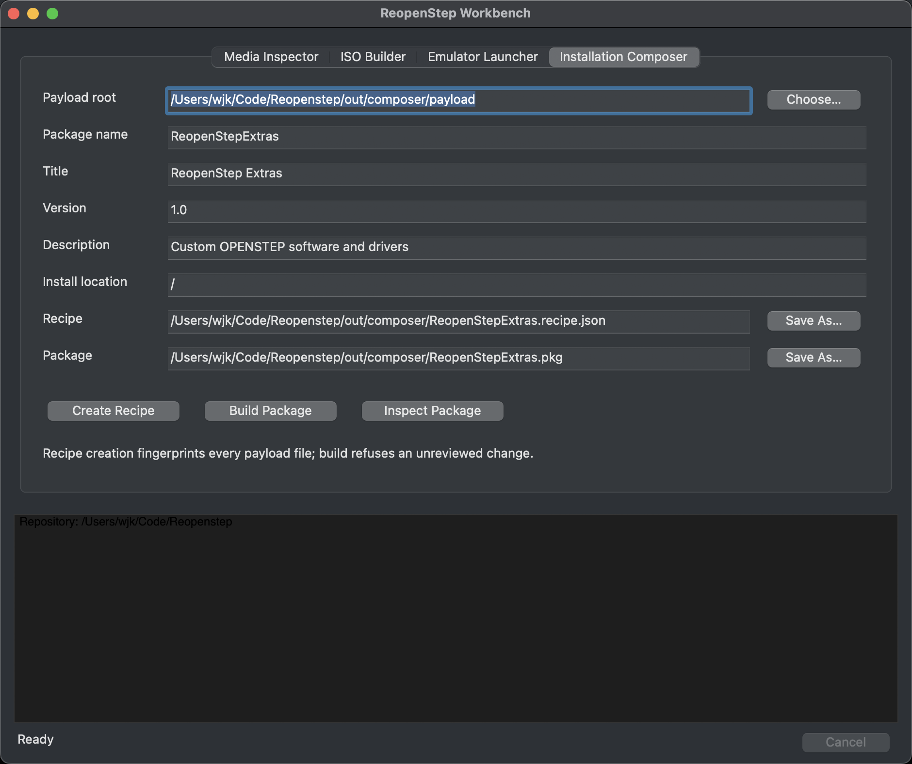

# Installation Composer and OPENSTEP packages

ReopenStep can compose a classic single-volume Installer package entirely on a
modern host. The output is a `.pkg` directory containing the four required
components:

- `Name.tar.Z`: a classic USTAR payload compressed with UNIX `compress`;
- `Name.bom`: the editable OPENSTEP transport bill of materials;
- `Name.info`: Installer metadata;
- `Name.sizes`: file count and installed/compressed size estimates.

This follows NeXT's published [Installer package specification](https://www.nextop.de/NeXTstep_3.3_Developer_Documentation/Concepts/Installer.htmld/index.html).
The packer requires `compress` or `ncompress`; it does not substitute gzip.

## Stage and build a package

Arrange the payload root exactly as it should appear relative to the package's
install location. For a fixed `/` installation, for example, an application
destined for `/LocalApps` belongs at `payload/LocalApps/Example.app`.

Create a reviewable recipe:

```sh
./reopenstep package plan \
  --root out/composer/payload \
  --name ReopenStepExtras \
  --title "ReopenStep Extras" \
  --version 1.0 \
  --description "Custom OPENSTEP software and drivers" \
  --default-location / \
  --output out/composer/ReopenStepExtras.recipe.json
```

The recipe records every path, type, mode, size, modification time, file hash,
link target, and a digest of the complete payload. Building fails if anything
changes after review:

```sh
./reopenstep package build \
  --recipe out/composer/ReopenStepExtras.recipe.json \
  --output out/composer/ReopenStepExtras.pkg

./reopenstep package inspect out/composer/ReopenStepExtras.pkg
```

The output directory must not already exist. This prevents an accidental
overwrite of a previously tested package.

## BOM maker and inspector

Generate only the editable transport BOM when iterating on payload ownership:

```sh
./reopenstep package bom \
  --root out/composer/payload \
  --owner 0 --group 0 \
  --output out/composer/ReopenStepExtras.bom

./reopenstep package bom-inspect out/composer/ReopenStepExtras.bom
```

NeXT's specification describes this BOM as one ASCII record per installed
file, excluding directories. Installer converts the delivered record into its
binary receipt form. The inspector distinguishes three important formats:

- `openstep-text`: the editable package-transport form generated here;
- `openstep-installed-binary`: the older NeXT receipt form observed on the
  OPENSTEP 4.2 Patch 4 media;
- `darwin-bomstore`: the newer Mac OS X format emitted by current macOS
  `mkbom`, which must not be substituted without an OPENSTEP compatibility
  test.

The generated archive owns its entries as `root:wheel` (`0/0` by default),
preserves modes and timestamps, and rejects non-ASCII, unsafe, or classic-tar-
incompatible paths. FIFOs, sockets, and device nodes are also rejected rather
than silently producing a package with ambiguous host-specific behavior.

## Workbench



The Installation Composer tab exposes the same plan, build, and inspect
operations. It passes paths and metadata to the repository CLI as argument
arrays; package rules are not duplicated in Objective-C. The initial surface
composes one payload root. Package collections, scripts, localized resources,
collision views, and direct UFS/ISO insertion can build on the versioned recipe
without changing the package format.

The host-side structural result is a compatibility candidate. The remaining
acceptance test is to open and install a generated fixture with OPENSTEP 4.2
Installer, then verify its receipt and uninstall behavior.
