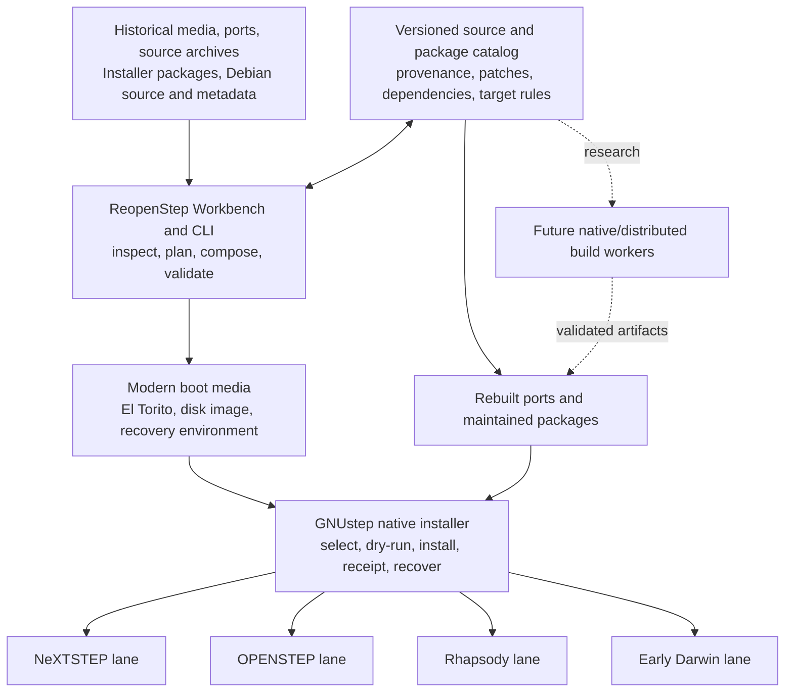

# ReopenStep: A Sustainable Installation and Software Future

## 1. The Opportunity

NeXTSTEP, OPENSTEP, Rhapsody, and early Darwin remain unusually complete
computing environments. They combine a coherent object-oriented application
platform, a Unix foundation, strong development tools, display and printing
systems, native packaging, and network-transparent application technologies.
They are not merely collections of binaries preserved for demonstration. They
still contain useful software, source code, documentation, and architectural
ideas that can support continued development if the systems can be installed,
rebuilt, and maintained reproducibly.

The immediate problem is not a total absence of material. The opposite is
true. Historical collections contain source ports, Debian binary and source
packages, classic NeXT Installer packages, vendor driver updates, SDKs, patch
sets, and substantial open-source operating-system releases. The challenge is
that these materials belong to different moments in the platform's evolution.
They assume different kernels, filesystems, compiler behaviors, framework
ABIs, package receipts, driver models, boot loaders, and hardware. A package
existing somewhere is not the same as having a repeatable way to build,
install, test, update, and recover it.

ReopenStep exists to create that repeatable path. Its goal is to make the
early NeXT and Apple operating-system family installable from modern media,
maintainable from modern hosts, and capable of receiving rebuilt software
without erasing the differences that make each system historically and
technically distinct. NeXTSTEP, OPENSTEP, Rhapsody, and early Darwin are equal
project goals. They are not assumed to be one runtime, one ABI, or one
filesystem. ReopenStep treats them as related compatibility lanes connected by
shared tooling, source provenance, package metadata, testing, and installation
workflows.

This distinction matters. A universal replacement kernel or a single binary
that transparently crosses every release boundary would require resolving
changes larger than this project can responsibly address today. The kernel
entry contract changed. Filesystem byte order and on-disk structures changed.
DriverKit evolved and was later displaced by IOKit. Foundation and AppKit
interfaces moved, as did libc, Objective-C runtime behavior, Mach interfaces,
and package formats. Even two systems using i386 Mach-O binaries may require
different builds because a fat-binary header selects a processor architecture,
not an operating-system ABI.

Those limits do not make the project impractical. They identify where the
boundaries must be. A modern boot path can select the correct kernel handoff.
A cross-platform manager can inspect and compose media without requiring a
working historical machine. A native GNUstep installer can provide a coherent
installation and recovery experience inside an early i386 environment. A
source-first ports pipeline can rebuild software separately for each target.
The resulting packages can retain the native conventions of the system that
will install them.

The opportunity is therefore larger than producing one convenient ISO. The
near-term product is an installation environment. The durable product is an
ecosystem for preserving source, recording adaptations, rebuilding software,
testing target-specific artifacts, and delivering them through formats that
the original systems understand. If successful, ReopenStep turns a scattered
historical software library into a maintainable body of work.

## 2. What Already Works

ReopenStep begins from working evidence rather than a clean-sheet proposal.
The repository can inspect original media, combine OPENSTEP User and Developer
content, apply Patch 4 inputs, stage DriverKit bundles, compose classic
Installer packages, and master hybrid optical images. It records source-media
identity and generated-artifact structure so that a build can be reproduced
and a failure can be located at a specific boundary.

The modern boot lane is called BootE. It is derived from the NeXT-aware parts
of Chameleon/boot132 and is built from pinned source with deterministic
configuration. BootE can start from BIOS and no-emulation El Torito media,
discover NeXT disk labels, interpret their 24-bit partition fields, locate a
big-endian NeXT UFS root, load an i386 Mach-O kernel, and choose a handoff based
on the target family. This is not a superficial catalog check. QEMU tests have
observed the OPENSTEP kernel enabling paging, installing its descriptor and
interrupt tables, processing the supplied system configuration, and advancing
into DriverKit initialization.

OPENSTEP requires more than loading `mach_kernel`. Its boot loader links
standalone DriverKit `_reloc` images with `sarld`, appends their configuration
tables, and publishes address and size records in a fixed low-memory
`KERNBOOTSTRUCT`. BootE reproduces this behavior for selected startup drivers.
The tested EIDE/ATAPI path identifies an emulated disk and optical drive, reads
their NeXT labels, and selects the CD root. Separate profiles preserve SCSI and
installed-system testing rather than hiding hardware differences behind one
nominally generic configuration.

The media path is similarly concrete. The project can produce a combined User
and Developer image with corrected NeXT partition metadata, expose Developer
content as a second UFS partition, and drive package installation through the
original package BOMs. QEMU and 86Box wrappers keep installation, rescue, and
installed-disk lifecycles separate. The regression harness records screenshots,
OCR output, timings, hashes, disk-label evidence, and machine-readable reports,
allowing an expected boot milestone to advance as implementation improves.

Package tooling already understands the classic four-part Installer shape:
`Name.tar.Z`, `Name.bom`, `Name.info`, and `Name.sizes`. It can fingerprint a
staged payload, write a reviewable recipe, build a package without silently
overwriting an earlier result, and inspect the output for structural
compatibility. It distinguishes the editable OPENSTEP transport BOM, the
installed binary receipt form, and the later Darwin BOMStore format instead of
assuming that a modern `mkbom` result is interchangeable with a NeXT receipt.
The graphical ReopenStep Workbench exposes the same operations through a
GNUstep/AppKit interface while delegating policy to the shared command-line
implementation.

Rhapsody and Darwin research has also moved beyond naming similarities.
Analysis of the Rhapsody DR2 i386 boot path establishes how its first-stage
loader locates boot2 and how the kernel mounts a native-endian BSD 4.4-derived
UFS root. That is materially different from the older byte-swapped NeXT UFS
used by OPENSTEP on i386. The vault also contains a separate Darwin 0.3 i386
QCOW build/root image. Its contents identify a Rhapsody 5.0.41.1 boot path and
a `RELEASE_I386` kernel build, making it the relevant early Darwin build-root
candidate; the PowerPC/APM Darwin image remains reference material rather than
a project target.

Finally, the repository contains scaffolding for repeatable multi-architecture
builds and a native Distributed Objects controller and worker. Build plans
name a source snapshot, target, profile, architecture set, toolchain digest,
and output. The fat-binary inspector validates the historical m68k, i386,
hppa, and sparc architecture records. These pieces do not yet constitute a
production build farm, but they prove that package composition, target
identity, architecture slices, and native job dispatch can share one
reproducible model.

The detailed evidence and current test boundaries are maintained in the
[implementation status](implementation-status.md), [boot reverse-engineering
notes](boot-reverse-engineering.md), [BootE handoff notes](chameleon-ufs-boot.md),
and [installation composer specification](installation-composer.md). This memo
uses those results as a baseline, not as a claim that installation and runtime
compatibility are complete.

## 3. Constraints That Force the Architecture

The systems are related, but their differences are structural. ReopenStep
must preserve those differences in its design rather than defer them as bugs
to be solved after a universal image has been assembled.

| Constraint or blocker | Consequence | Architectural decision |
|---|---|---|
| OPENSTEP reads a fixed `KERNBOOTSTRUCT`; Darwin consumes a different boot-argument contract | One generic kernel jump cannot safely boot every target | BootE selects a target-specific kernel handoff profile |
| OPENSTEP i386 uses byte-swapped older NeXT UFS while Rhapsody i386 uses native little-endian BSD 4.4 UFS | A reader or mutator validated on one family can corrupt or misclassify another | Maintain explicit filesystem implementations and require family identification |
| OPENSTEP/Rhapsody use `sarld`, `_reloc` images, and DriverKit tables; later Darwin uses IOKit, kexts, and boot archives | Drivers cannot be copied or translated as ordinary files | Preserve distinct driver-loading and configuration lanes |
| Framework, libc, Objective-C runtime, Mach, and command-line interfaces changed | Successful linking on one release does not establish runtime compatibility on another | Build and test against target-specific SDKs and sysroots |
| Fat Mach-O dispatch selects CPU type, not OS ABI | Two incompatible i386 builds cannot occupy ordinary interchangeable i386 slices | Package per-target i386 variants even when architecture names match |
| Classic Installer BOMs differ from later Darwin BOMStore receipts | Modern package tools can produce plausible but incompatible output | Parse, generate, and validate each receipt family explicitly |
| Debian packages assume Debian filesystem, dependency, maintainer-script, and libc conventions | A `.deb` cannot be treated as a native OPENSTEP installation unit | Use Debian packages as source, dependency, and patch references; rebuild and repackage |
| Host-side UFS creation, resizing, and repair support remains incomplete for every historical variant | Arbitrary roots cannot yet be synthesized safely from nothing | Start from validated seed images and make transactional, inspectable changes |
| Historical drivers encode narrow hardware assumptions | A media image that boots one emulator profile may fail before installation elsewhere | Maintain hardware profiles and a regression matrix rather than one unqualified HCL |
| Distributed Objects compatibility across Foundation generations is unproven | Native remote objects may fail at serialization, naming, transport, or runtime boundaries | Treat distributed builds as future research and retain a simple transport fallback |

These constraints establish the project's central rule: share source,
metadata, workflow, and validation wherever possible, but do not share a
binary or on-disk mutation path merely because two systems have related names.
The compatibility layer belongs in explicit adapters and build targets, not in
assumptions.

This also changes how progress should be measured. Booting a newer kernel on
an older userland is useful research, but it is not automatically a supported
installation combination. Reading a directory from a filesystem is not proof
that allocation, resizing, and repair are correct. Producing a Mach-O file is
not proof that its Objective-C runtime or frameworks are compatible. A package
that can be unpacked is not complete until the target Installer accepts its
metadata, writes the expected receipt, and can remove or upgrade it.

The acceptance boundary must therefore be end to end. Each target lane needs
a known boot profile, filesystem identification, kernel and driver handoff,
SDK or sysroot, package format, installation test, first-reboot test, and
artifact record. This costs more than optimistic binary reuse, but it creates
results that can be maintained after the original investigator has moved on.

## 4. The Installation Environment

The practical center of ReopenStep is a two-part installation system. The
first part runs on a modern host. The second runs in the booted historical
environment. They share recipes and reports but have different responsibilities.

The modern ReopenStep Workbench and command-line tools acquire local inputs,
verify hashes, inspect media, identify filesystem and package families,
resolve a selected profile, compose packages, construct bootable media, launch
emulators, and retain validation evidence. This is where large files, current
cryptographic hashes, automation, and cross-platform workflows belong. It
allows a user to prepare or audit an installation without first possessing a
working OPENSTEP machine.

The native component will be a GNUstep installer informed by the compact,
task-oriented workflow of the Puma-era Installer. It will be an original
implementation, not a dependency on later Cocoa or a copy of proprietary UI
code. It should run in the Darwin 0.3/Rhapsody i386 build-root environment and,
where the APIs permit, in the other supported lanes. Its core workflow is
familiar: inspect the selected package collection, choose a target volume,
review required and optional components, show space and dependency results,
perform a dry run, install with a visible progress log, write native receipts,
and offer recovery information.

The installer must keep privileged filesystem work separate from presentation.
Its package engine reads classic package metadata and planned future target
formats, verifies payload identity, checks ownership and modes, detects path
collisions, evaluates target and architecture requirements, and produces an
ordered operation journal. A small privileged helper applies that journal to
the selected root. Completed operations and receipts provide the information
needed for failure recovery, removal, and eventual upgrades. No graphical
success screen should substitute for a verified target receipt and post-install
probe.

The resulting system has the following shape:

Modern media is valuable because it removes unnecessary physical constraints
without pretending that the target is modern. El Torito boot, larger optical
images, virtual disks, and emulator snapshots can coexist with NeXT disk
labels, historical UFS roots, DriverKit bundles, and classic packages. The
installer can carry recovery tools, package catalogs, build manifests, and
diagnostic reports that would not fit comfortably into the original floppy-led
process. The target system still receives its native kernel, userland, drivers,
and receipts.

This architecture also supports incremental adoption. The first useful native
installer need not partition every disk or install every operating system. It
can open a real package, display its metadata and BOM, select a disposable
target root, and produce a trustworthy dry-run journal. The next increment can
extract a payload and write a receipt. Volume preparation, complete system
installation, upgrades, rollback, networking, and package catalogs can then be
added behind interfaces already exercised by small tests.

## 5. A Maintainable Software Ecosystem

Installation solves access; source stewardship creates longevity. ReopenStep
should treat every recoverable software artifact as an input to a documented
maintenance pipeline rather than as an opaque binary to be copied into the
next image.

The pipeline begins with provenance. A port should identify its upstream
source release, original target, historical patch set, build instructions,
expected libraries, and known package outputs. Subsequent maintenance belongs
in a reviewable patch series rather than an anonymously modified source tree.
The build record identifies the target system, SDK or sysroot, compiler and
toolchain digest, architecture, configuration, tests, and resulting artifact
hashes. This makes it possible to distinguish an upstream source change from a
compiler workaround, ABI adaptation, or packaging correction.

Different artifact collections contribute different information. Existing
NeXTSTEP and OPENSTEP ports demonstrate source adaptations and expected
installation locations. KB7SQI package sources offer a concrete body of
software to rebuild and update. Classic Installer packages provide payload,
metadata, ownership, and receipt conventions. Debian source packages provide
maintained upstream tarballs, dependency descriptions, patches, and security
history. Debian binary packages can help inventory versions and file layouts,
but their binaries and maintainer scripts are not presumed compatible with a
NeXT runtime. Darwin and other open-source releases provide kernels, userland,
libraries, and historical interfaces that can be compared and rebuilt.

Each adopted project should produce target-specific outputs. A source tree may
share most code across NeXTSTEP, OPENSTEP, Rhapsody, and Darwin, while small
compatibility layers isolate framework, libc, compiler, or filesystem
differences. Architecture-fat output remains useful when the target ABI is the
same across m68k, i386, hppa, and sparc slices. Where two systems require
different i386 binaries, the package catalog selects separate target payloads
rather than constructing a misleading fat file.

The package catalog becomes the durable interface between ports and the
installer. It records names, versions, dependencies, conflicts, architecture
and OS targets, source provenance, build recipes, payload hashes, installation
locations, and native package artifacts. It does not need to invent a new
runtime package format immediately. The catalog can wrap and relate classic
Installer packages while preserving the `.tar.Z`, BOM, information, sizes,
and receipt behavior expected by the destination system.

Maintenance also requires negative information. A failed build, incompatible
library, unimplemented syscall, receipt mismatch, or first-reboot regression
should be captured as a target-specific result. This prevents each contributor
from rediscovering the same boundary and stops a successful build on one lane
from being generalized to all lanes. Over time, the catalog becomes a tested
compatibility map as much as a download index.

The first representative objective should be modest and complete: rebuild one
KB7SQI-derived utility or similarly available port from recorded source in the
Darwin 0.3 i386 environment, package it for one target, install it into a
disposable root, run it, write and inspect its receipt, remove it, and repeat
the process from a clean snapshot. The same source can then be introduced to
the other target lanes. This creates a template for hundreds of future ports
without requiring the project to solve every ABI transition first.

## 6. Roadmap and Long-Term Value

The roadmap should advance complete vertical paths rather than accumulate
unconnected format readers and boot experiments.

The immediate phase is the installation foundation. ReopenStep must boot the
Darwin 0.3 i386 QCOW environment reproducibly, capture its console and root
state, identify its compiler, headers, libraries, package tools, and startup
contracts, and establish a disposable writable build root. In parallel, the
native GNUstep installer should reach package inspection and dry-run planning
using the same fixture packages already produced by the host composer. The
OPENSTEP media path should complete its Installer acceptance test and retain
first-reboot evidence for each supported storage profile.

The next phase establishes maintained software delivery. It adds a versioned
package catalog, source and patch adoption, dependency and collision reporting,
target-specific sysroot definitions, and repeatable builds for a small set of
representative ports. The native installer advances from dry runs to payload
application, native receipt writing, removal, and recovery. Tests cover a
clean install, reinstall, upgrade where supported, failure during extraction,
receipt validation, removal, and reboot of the modified target.

The third phase broadens system coverage without collapsing the lanes. BootE
gains complete selection of OPENSTEP, Rhapsody, and Darwin roots from combined
media. Filesystem tooling advances from read-only inspection and seed-image
mutation toward validated creation, resizing, and repair for each required UFS
family. Driver profiles expand only with reproducible emulator or hardware
evidence. Kernel and userland rebuilds proceed component by component against
known roots, beginning with artifacts whose behavior can be compared directly
with the preserved binaries.

Distributed Objects belongs beyond these installation and maintenance
milestones. NeXT's distributed platform remains a compelling opportunity: a
native controller could dispatch architecture or target builds to machines
that possess the appropriate SDK, compiler, and runtime, then return logs and
artifacts through familiar Foundation interfaces. The repository already has
a reference controller and worker. However, interoperability across Foundation
versions, object serialization, name registration, transport, and error
behavior must be proven with a small compatibility matrix. Until then,
Distributed Objects is research, not a dependency of the installer or package
pipeline. A simple request/response transport can preserve the build model if
native remote objects do not cross a particular boundary.

Success is measurable. A contributor should be able to identify source,
produce a target build from a recorded environment, generate a native package,
install it from modern boot media, validate its receipt and behavior, and
repeat the process on a clean machine. A user should be able to understand
which target and hardware profile an artifact supports. A maintainer should be
able to trace every delivered file to source, patches, build inputs, and test
evidence. A researcher should be able to add a new kernel, filesystem, driver,
or Distributed Objects result without weakening the claims made for existing
lanes.

ReopenStep cannot remove every historical incompatibility today, and it does
not need to. Its value is in making those incompatibilities explicit,
testable, and maintainable while delivering useful installation and software
work now. Modern media, a cross-platform manager, a native GNUstep installer,
reproducible ports, and target-specific package lanes are enough to turn the
available library into a living system again. The longer-term distributed
platform can then grow from a dependable installation and build foundation
rather than from another one-off image.
